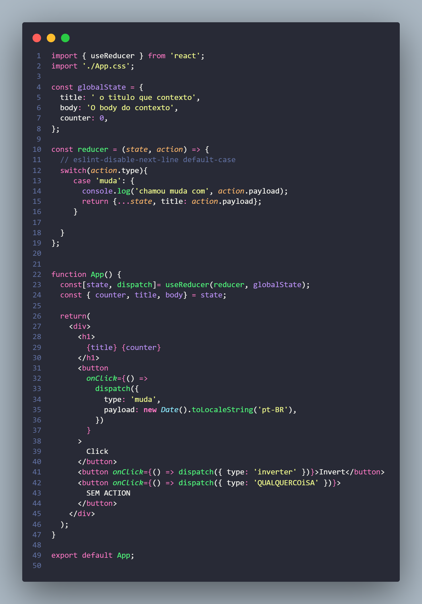
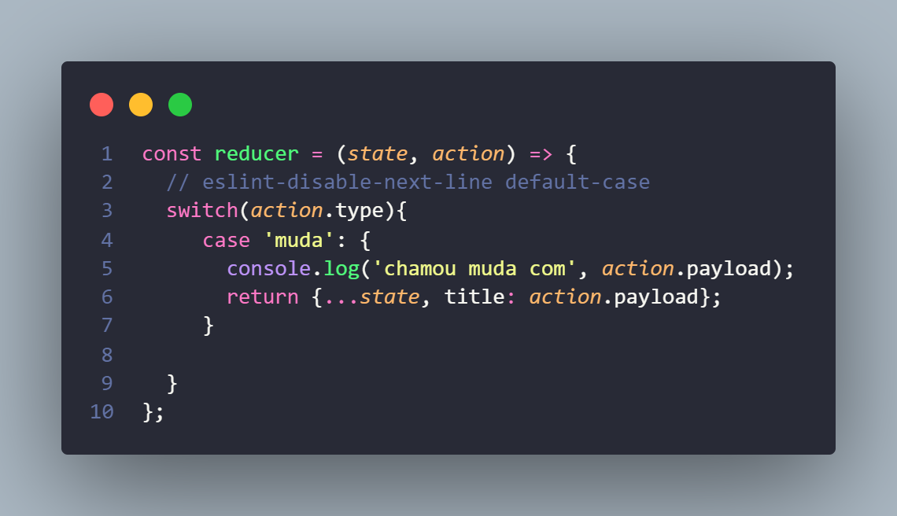
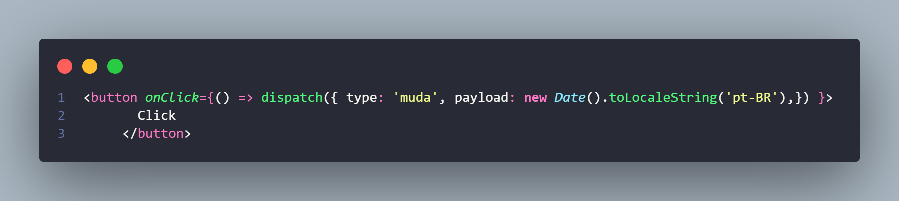
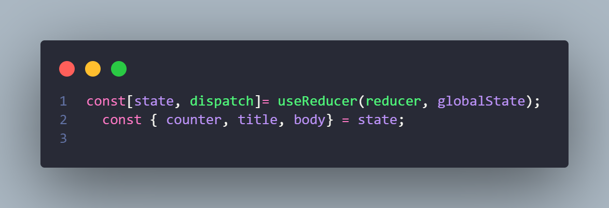

### <h1>Estudo de Hooks</h1> 

- [useReducer](https://pt-br.reactjs.org/docs/hooks-reference.html#usereducer): Uma alternativa para useState. Aceita um reducer do tipo (state, action) => newState e retorna o estado atual, junto com um método dispatch.useReducer é geralmente preferível em relação ao useState quando se tem uma lógica de estado complexa que envolve múltiplos sub-valores, ou quando o próximo estado depende do estado anterior. useReducer também possibilita a otimização da performance de componentes que disparam atualizações profundas porque é possível passar o dispatch para baixo, ao invés de callbacks.
 
 
 1 - A função reducer só é disparado quando ela é chamada com Dispatch que vai acionar o parametro Action (ação) 
 state(objeto recebido em forma de parametro)  action(ação a ser realizada); 
 
   
 
 2-  Dispatch aciona um tipo de ação (type: 'muda ')
 
 
 3 - useReducer recebe como pârametro uma função(reducer) e um objeto(globalState).
 
 
 
 

